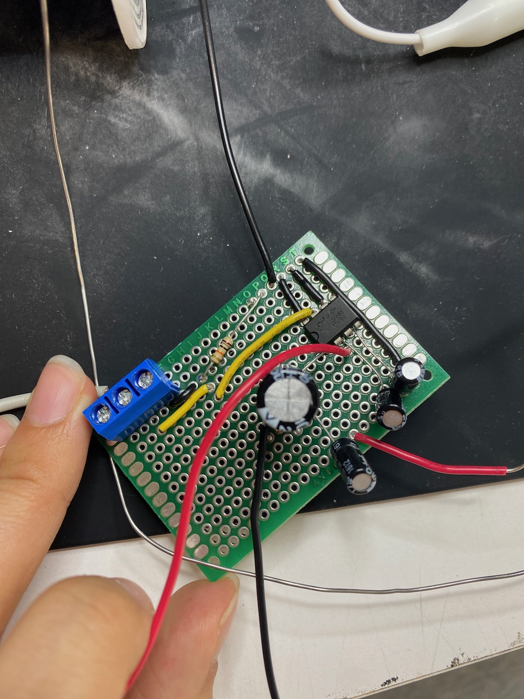

# DIG333-Project1 - Highlight of My Day

## Milestones
<ol>
<li>Set up hardware 
<li>Coding(api calls, text->speech conversion)
<li>Testing
<li>Deliverable
</ol>

### Setp up hardward
It was very easy setting up the PIR sensor. I followed the [Youtube video](https://www.youtube.com/watch?v=Tw0mG4YtsZk&ab_channel=TechWithTim) made by Youtuber [Tech With Tim](https://www.youtube.com/@TechWithTim). I also found [this guide](https://projects.raspberrypi.org/en/projects/physical-computing/11) on Raspberry Pi's website very helpful. 
 
The audio part of the project took me the longest to figure out, because I had to build an amplifier. I followed [this guide](https://www.instructables.com/Tales-From-the-Chip-LM386-Audio-Amplifier/) that Dr. Mundy found that has a detailed breadboard implementation.  
 
Turning my breadboard into a chip took me another 10+ hours. I first soldered a chip, only to realize that my amplifier is placed backwards. Here is the first chip  

 
I had to cut part of chip and put it onto a new one. This is the final product.  
 

### Coding
Coding went very smoothly, I started off with code for the LED and PIR sensor to detect motion.  

    from gpiozero import LED, MotionSensor
    green_led = LED(17)
    pir = MotionSensor(4)
    green_led.off()
    
    while True:
       pir.wait_for_motion()
       print("Motion Detected")
       green_led.on()
       time.sleep(10)
       pir.wait_for_no_motion()
       green_led.off()
       print("Motion Stopped")
       
       
       
Then I added code for gTTS(Google Text-To-Speech) and API calls to https://complimentr.com/ and https://www.weatherapi.com/. The final code is *** insert final code***

### Testing
I first included a LED light on the breadboard to test the PIR sensor. After making sure the sensor is working, I removed the LED and Pi Cobbler to make my device more compact. I also tested the functionality after adding each piece and before putting my device into the case. 

### Deliverable.
 

*** insert link to video in drive***

## Creator statement
Q: What is the motivation behind this project?  
A: This is a project without utility, meaning that I don't need a potential for commercial use or anything significant from this prooject. This project is called "Highlight of My Day" because I want to lighten up my roommate's day every now and then. 

Q: What technologies did I use in the project? 
A: The technologies I used in this project include PIR sensor, Raspberry Pi, hand-made amplifier chip, speaker, gTTS(Google Text-To-Speech), API calls to https://complimentr.com/ and https://www.weatherapi.com and os commands.

Q: What was the most challanging part of this project? 
A: The audio part of the project was the most challanging. I found out half-way into the project that I had to build an amplifier. I followed this guide mentioned above, but it was still very difficult. At first, we didn't have any 1000uf capacitor, so I had to connect a bunch of jumper wires and use 4 220uf capacitors in parallel to get something close to 1000uf. The next week, Dr. Mundy got some 1000uf capacitors and a bigger speaker, which worked slightly better than the mini one. 
Turning my breadboard into a chip took me another 10+ hours. I first soldered a chip, only to realize that my amplifier is placed backwards. I had to cut part of chip and put it onto a new one. It was very hard trying to put everything in place while trying to remember the solder connections on the back. I tried tools like Tinkercad but unfortunately was not able to simulate the circuit because they were missing some components.

Q: What would I have done differently when making the chip? 
A: Ideally I would use a tool that allows me to visualize the circuit on a chip and make sure it works. I make many mistakes while building the chip and had to do many patching work (hence the capacitors soldered to the back of the chip).

Q: Do I think this project is perfect? What can be improved? 
A: I think I was able to achieve most goals planned in the pitch, exept the indoor temperature monitor. My initial goal was to also include a temperature sensor and also speak the indoor temperature whenever the PIR sensor is triggered. When I started playing around with the temperature sensor, I realized that it is very inaccurate, often +-2 degrees celcius different than the accurate temeprature. This inaccuracy leads to the sensor not effectively measuring the temeprature change indoors, thus losing the purpose of using a sensor at all. Therefore, I resorted to using a temperature API that provided very accurate outdoor temperature in the area.
